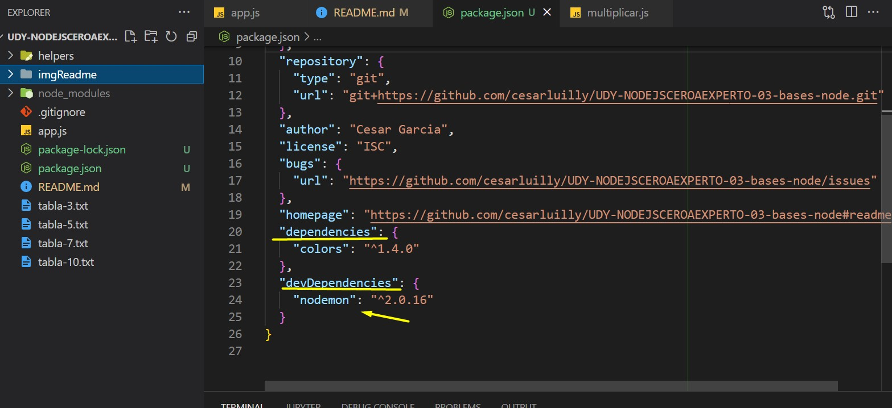

# UDY-NODEJSCEROAEXPERTO-03-bases-node

## Video 29, 30

Normalmente archivo de punto de entrada a nuestra aplicacion
se llama `app.js` o `index.js` y tiene que estar lo mas limpio posible.

Aprender sobre el uso de requerir paquetes e ir a la documentacion
de node para aprender mas sobre los metodos y como traer un paquete
de nodejs a nuestra aplicacion.

Documentacion de filesystem para grabar archivos.
https://nodejs.org/dist/latest-v16.x/docs/api/fs.html#fswritefilefile-data-options-callback

## Video 31 Importar archivos
Separamos en modulo para parte de crear archivo de nuestro app.js y lo convertimos en una promesa.

## Video 32 Recibir informacion desde la linea de comando
Ahora veremos como recibir informacion de consola y es a traves de lo siguiente a traves de **process.argv**
```
const [ , ,arg3 = 'base=5'] = process.argv;
const [ , base = 5] = arg3.split('=');
```
y la manera de mandarselos desde la consola es:

```
node app.js --base=10
```
Pero esto trae inconvenientes, por la posicion del arreglo en 
donde caiga nuestro parametro --base=10 validaciones para el 
splits

## Video 33 package.json - init - install - uninstall

npm que es un gestor de paquetes de nodejs. es recomendable 
trabajar siempre con paquetes que tenga un numero alto de 
descargas.

* A partir cuando creemos proyectos de node siempre vamos a ejecutar el siguiente comando
> `npm init`

y esto nos va a crear nuestro package.json

Si yo en package.json agrego **base3 y lo que contiene**
```json
"scripts": {
    "base3": "node app --base=3"
  },
```

Entonces yo en la consola lo ejecutaria de la siguiente manera 
`npm run base3`

### Vamos a instalar el repositorio de colors
https://www.npmjs.com/package/colors

Ejecutamos el comando 

> `npm install colors`

### Vamos a instalar nodemon pero que sea solo de desarrollo

Ahora vamos a instalar nodemon para desarrollo pero no
como dependencia del proyecto, ya que nodemon solo nos va 
a servir a nostros los desarrolladores.

Para eso ejecutamos.
> `npm install nodemon --save-dev`

**La bandera `--save-dev`** sirve para que se instale como 
dependencia de desarrollador y no como dependencia de proyecto 
y esto hace que se agregue al package.json.



* Ahora si queremos desintalar la dependencia de nodemon lo hariamos:

> npm uninstall nodemon

* Si yo quiero instalar una version en especifica de un paquete, 
lo hacemos poniendo `@version`. (esto seria por ejemplo que la version nueva no funciona como deberia de ser, etc y por eso necesitamos instalar una version especifica)

> `npm install colors@1.0.0`

* Tambien para actualizar las dependencias a su ultima version utilizamos
> `npm update`

Pero lo mejor seria actualizarlas manualemente.

## Video 34 Yargs

Yarg es un paquete superpopular que utilizan muchas librerias, 
muchos paquetes de manera implicita.

Vamos a la documentacion para conocer mas de este paquete
https://www.npmjs.com/package/yargs

> `npm i yargs`

## Video 35 Configuracion de Yargs.

Vamos a la documentacion de Yargs https://yargs.js.org/docs/
y buscamos a options https://yargs.js.org/docs/#api-reference-optionkey-opt

Vamos a ejecutar la aplicacion a traves de 

Si queremos crear el archivo de las tablas del **10** pero QUEREMOS
listarlo en la consola
> `node app.js -b 10` 

Si queremos crear el archivo de las tablas del **10** pero NO 
QUEREMOS listarlo en la consola
> `node app.js -b 10 -l` 


